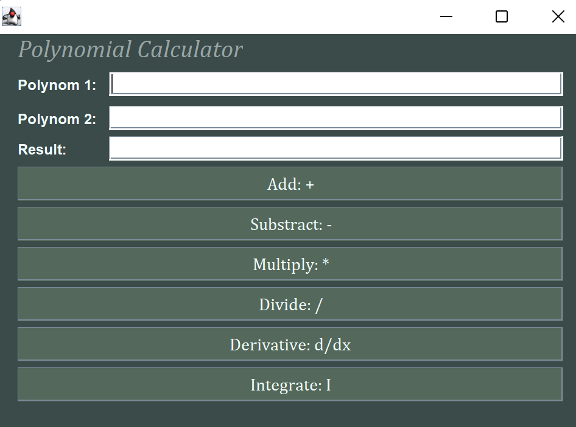

# Polynomial Calculator in Java

## 🧮 The main objective of this project is to design and implement a calculator that performs polynomial operations, featuring a graphical user interface (GUI) that allows the user to input polynomials and select the desired mathematical operation.
The available operations include: addition, subtraction, multiplication, and division. For a single polynomial, the calculator also supports differentiation and integration.
These operations must be performed using code implemented in Java, and the result of each operation must be displayed on the graphical interface. The interface is implemented using Java Swing.

  

    
  

## 👨‍💻 Author
Maria-Magdalena Creț
Technical University of Cluj-Napoca
Faculty of Automation and Computer Science
